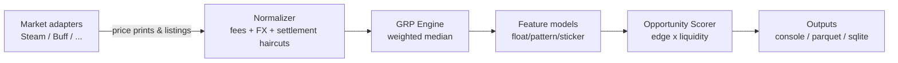
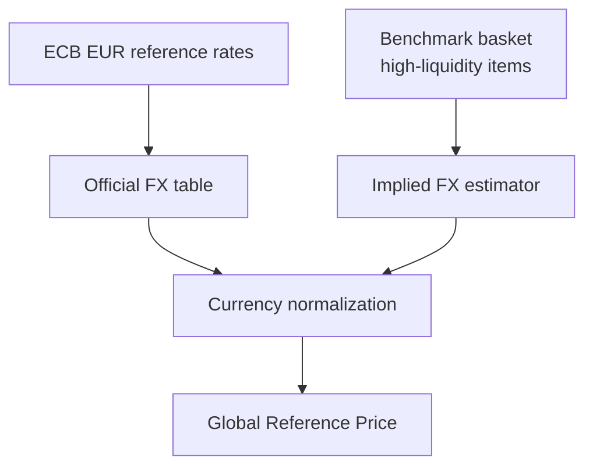

# Architecture

This repo is intentionally written as a **platform-engineering** case study: 
a small, testable pricing engine with clear module boundaries (markets / FX / pricing / scoring / storage).

## Data-flow (batch)

## Currency layer

Two distinct FX concepts are modeled:

- **Official FX**: central-bank FX (ECB daily reference rates), used as the first-pass normalization.
- **Implied / Effective FX**: a *market-specific* FX inferred from cross-listed benchmark items. This captures
  persistent basis caused by settlement constraints, regional demand, and platform frictions.

